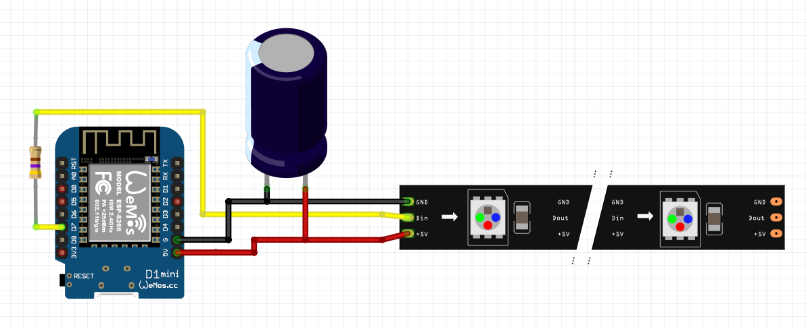

# moon-lamp-LED-ESP8266
ESP8266 software for a moon lamp controlled with a HTTP-server based on ESP8266 and WS2812-LED illumination

## Functionality

This is an illumination for a moon lamp based on an ESP8266 and WS2812b LED-light strip. A HTTP-Webserver is implemented to switch on and off the light and controll the LED setting (colour, brightness). Additional the last state is safed in the EEPROM to turn on the last state after an power off / loss.
The code is implemented in the Arduino IDE and is directly related to a reprint of a moon lamp.
For the housing etc. see  [https://www.thingiverse.com/thing:3238162](https://www.thingiverse.com/thing:3238162)

### Commands
- http://IP-ADRESS/on   -   Switching the LED-lights on
- http://IP-ADRESS/off - Switching the LED-lights off
- http://IP-ADRESS/command.html?param=setColor&value=red,green,blue - Turn light on and set to colour where red, green and blue are values betwenn 0..255 (e.g. value = 255,0,0 = pure red)

### Compling Code
The Arduino Code is in the subdirectory "MondLED-Server-NeoPixel-OTA_GitHub". In order to compile the ESP8266 for NodeMCU and the Neopixel Library needs to be installed through the Arduino Library Controll.
The WLAN-SSID and PASSWORD needs to be updated in the code, in order to access the local network.

### Code structure - brief overview
The code is implemented in C++, using different classes.
#### JomjolGitServerClass
- Basic class to implement HTTP-server
#### JomjolGitLEDBandComm
* Class to implement communication with LEDs
#### LED-Server-Class
- Inherited class of Server and LEDBand to combine LED controll and HTTP-server
#### MondLED-Server-NeoPixel-OTA_GitHub.ino
* Arduino file to setup and loop the programm. Additianlly implementin an OTA-interface to update the NodeMCU via Arduino IDE

## Physical Setup / Wiring / Components

### Components
- Node Mini D1 with ESP8266
- LED-Strip with WS2812b-Controller
- Capacity 1000uF
- Resistor 470 Ohm

### Wiring

